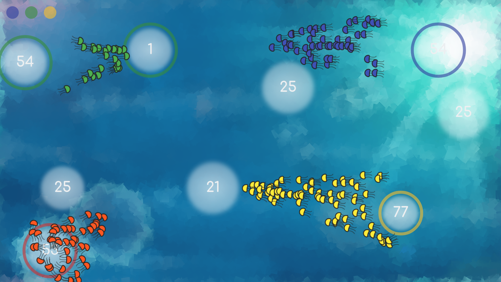
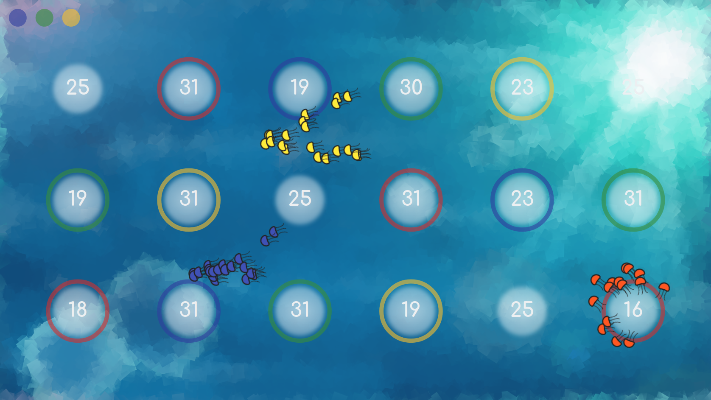
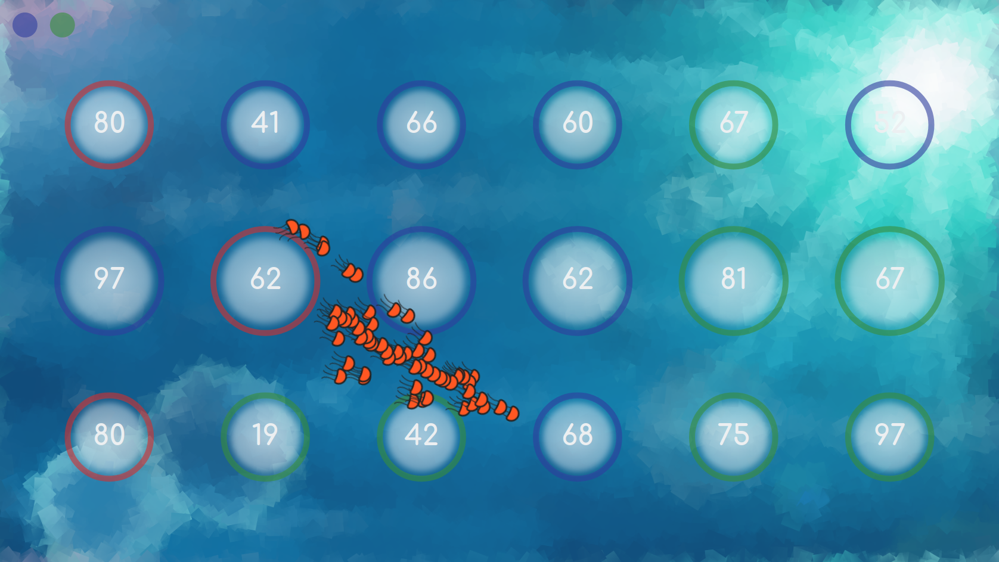

# Qualli

 
A JavaScript Game

## License

This project is licensed under AGPL (see `LICENSE`) except the Comfortaa font
files (in `datafiles/fonts/`). Refer to the
[upstream git-repository](https://github.com/googlefonts/comfortaa/)
for its licensing information.

## Run

### Web

Use any compatible web server, for example

    python -m http.server

Open `localhost:8000` in a browser.

### Electron

Run `npm run start`

### Android

Refer to [qualli-capacitor](https://github.com/niklassc-xyz/qualli-capacitor).

## Screenshots

## Goals

* No dependencies except [engine](https://github.com/niklassc-xyz/parapluie)
* No build steps
